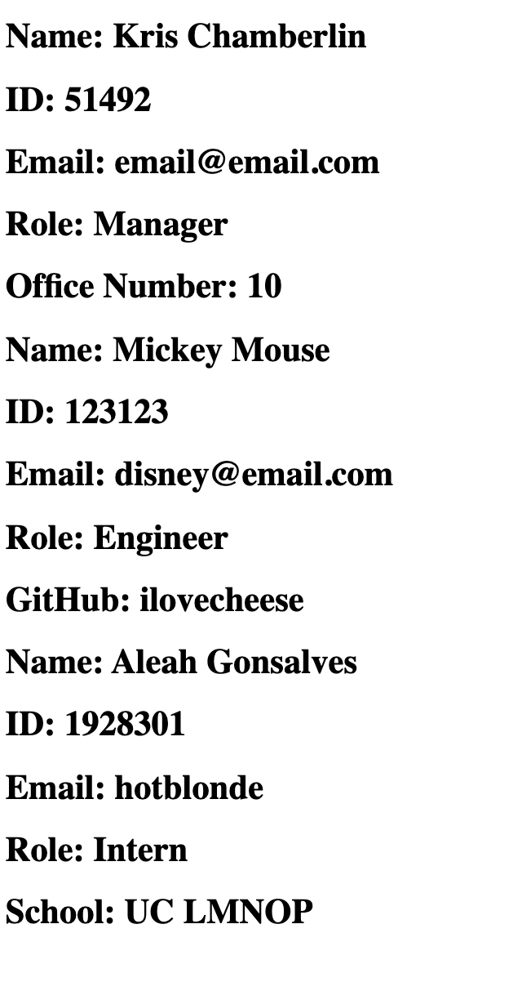

# Team-Profile

In this application, a user can input information via node.

Open the server.js file in the Terminal and run npm install.

The first set of questions asked will prompt the user for "Manager" questions, including:

    - Full Name 
    - ID 
    - Email 
    - Office Number.

The second set of questions asked will prompt the user for "Engineer" questions, including:

    - Full Name
    - ID
    - Email
    - GitHub Username

The third set of questions asked will prompt the user for "Intern" questions, including: 

    - Full Name
    - ID
    - Email
    - University / school attended

Once completed, the user's input will be generated onto an HTML page.

